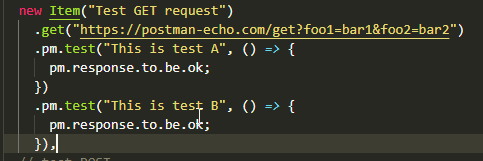
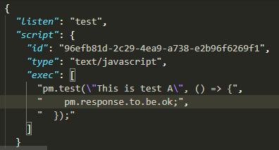
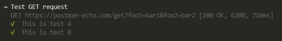

# Newman/Postman collection generator

> This module will bring your postman/newman experience to a next level

[![NPM Version][npm-image]][npm-url]

## Install

```bash
npm i newman-collection
```

## Usage

The only feature this module brings is simplified minimalistic JS-like creation of the collection file.

Newman is a tool developed by a postman team works with existing files or URL in CLI mode or with a model from [postman-collection][postman-collection] module as node.js module. This module is nothing more than decoration of postman-collection calls.

```js
const { Collection, Item } = require("newman-collection");
const newman = require("newman");

let oCollection = new Collection([
  // test GET
  new Item("Test GET request")
    .get("https://postman-echo.com/get?foo1=bar1&foo2=bar2")
    .pm.test("This is test A", () => {
      pm.response.to.be.ok;
    })
    .pm.test("This is test B", () => {
      pm.response.to.be.ok;
    }),
  // test POST
  new Item("Test POST request")
    .post("https://postman-echo.com/post")
    .headers({ "Content-Type": "text/plain" })
    .body("test")
    .pm.test("body should be same", () => {
      pm.response.to.have.jsonBody("data", "test");
    }),
  // test auth
  new Item("Test basic auth")
    .get("https://postman-echo.com/basic-auth")
    .auth.basic({ username: "postman", password: "password" })
    .pm.test("Must be authenticated", () => {
      pm.response.to.have.jsonBody("authenticated", true);
    })
]);

newman.run({
  collection: oCollection.collection,
  reporters: ["cli"]
});
```

#### class Collection

| method                                                                | description                                                                                                                          |
| :-------------------------------------------------------------------- | ------------------------------------------------------------------------------------------------------------------------------------ |
| _constructor_( _collection_?: CollectionDefinition , _items_?: Item ) | To create an instance you can provide collection definition from postman SDK. In addition to this list of items can be provided also |
| _constructor_( items\*?: Item )                                       | You can omit definition part providing just array of items                                                                           |
| _set_ items(_items_: Item) {                                          | A setter method is also availabe to set items later                                                                                  |

#### class Item

| method                                              | description                                               |
| --------------------------------------------------- | --------------------------------------------------------- |
| get/post/head/options/put/delete/patch (url:string) | these are factory functions for Request of a certain type |

#### interface Request

| method                           | description                                                                                                                                                                                                                                                                                                                                                   |
| -------------------------------- | ------------------------------------------------------------------------------------------------------------------------------------------------------------------------------------------------------------------------------------------------------------------------------------------------------------------------------------------------------------- |
| body(body:string\|object)        | Sets body, converts to JSON if needed                                                                                                                                                                                                                                                                                                                         |
| headers(headers: object)         | Sets request headers in a similar to fetch API way                                                                                                                                                                                                                                                                                                            |
| auth.basic({username,password})  | Provides basic authentication. Do not use secret data in your code but use {{secret}} variables instead.                                                                                                                                                                                                                                                      |
| on.prerequest(callback:Function) | This function along with test script also is probably the main purpose of this module creation. It is extremely not convenient to work with a collection file editing script as string data, not a code.                                                                                                                                                      |
| on.test(callback:Function)       | test script writer, same as prerequest                                                                                                                                                                                                                                                                                                                        |
| pm.test(description, callback)   | Even more simplified way of creating test scripts. This is what it does: <br />will create JSON like this: <br />and finally in the console we can have this: |

## License

[MIT](http://vjpr.mit-license.org)

[npm-image]: https://img.shields.io/npm/v/newman-collection.svg
[npm-url]: https://npmjs.org/package/newman-collection
[travis-image]: https://img.shields.io/travis/live-js/newman-collection/master.svg
[coveralls-image]: https://img.shields.io/coveralls/live-js/newman-collection/master.svg
[coveralls-url]: https://coveralls.io/r/live-js/newman-collection?branch=master
[postman-collection]: https://github.com/postmanlabs/postman-collection
